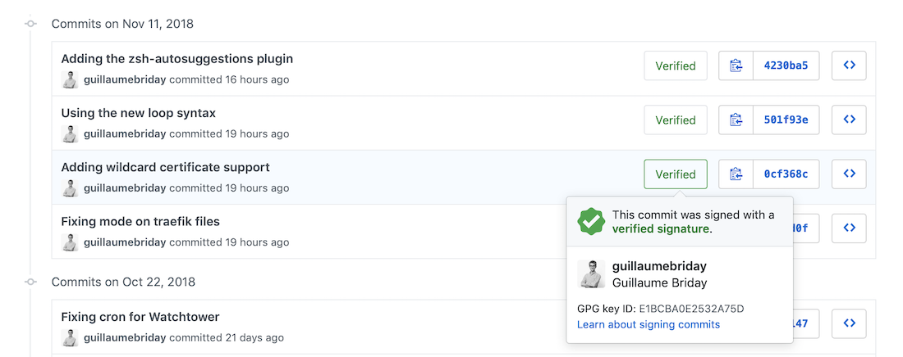

Sur Git, il existe un moyen de prouver que vous êtes bien l'auteur d'un commit pour indiquer qu'il est bien de source sûre aux autres utilisateurs. Aujourd'hui, nous allons voir comment mettre en place le fonctionnement.

Pour signer les commits, nous allons utiliser les [clés GPG](https://en.wikipedia.org/wiki/GNU_Privacy_Guard). De la même manière que SSH, nous allons devoir générer une clé privée et une clé publique pour le client et le serveur.

## Installation sur macOS

Pour utiliser les commandes nécessaires à la génération de clés et la lecture, il faut installer la suite [GPG](https://www.gnupg.org) :

```bash
$ brew install gnupg
```

## Générer une clé

```bash
$ gpg --full-generate-key
```

Plusieurs questions vont alors vous être posées :

Pour le type de clé, nous voulons une clé `RSA and RSA`, l'option `1`.

Il faut choisir une taille en bits, nous prenons le maximum soit `4096` pour plus de sécurité.

Vous pouvez choisir une période de validité de la clé, personnellement je préfère ne pas mettre de date limite.

Confirmez les informations puis indiquez votre nom et votre email.

Terminez la configuration en tapant `O` puis `entrer`.

Définissez une passphrase `forte` et `unique` !

Votre clé est maintenant générée comme il devrait vous l'indiquer dans le retour.

## Intégration avec Git

Vous pouvez lister les clés avec la commande :

```bash
$ gpg --list-secret-keys --keyid-format LONG [email]

sec   rsa4064/8180D3DC11D47453 2018-11-11 [SC]
      CA67091517BC824B498858CD8180D3DC11D47453
uid                 [ultimate] demodemo <demo@demo.fr>
ssb   rsa4064/BA579BCEB3343AB0 2018-11-11 [E]

```

Vous pouvez générer autant de clé que besoin, elles apparaîtront toutes dans cette liste. Vous pouvez rajouter un `email` à la fin de la commande pour filtrer uniquement les clés correspondant à cette adresse.

La partie qui nous intéresse est l'id de la clé, soit `CA67091517BC824B498858CD8180D3DC11D47453` dans cet exemple.

C'est ce qui va nous permettre d'indiquer à Git comment faire le lien avec notre clé.

Pour gérer les clés GPG avec Git de façon globale :

```bash
$ git config --global gpg.program gpg
$ git config --global user.signingkey [key-id]
$ git config --global commit.gpgsign true # Optionnel
```

Remplacez `[key-id]` par l'id de la clé, dans mon cas `CA67091517BC824B498858CD8180D3DC11D47453`.

Cet ID n'est pas privé, vous pouvez le partager dans [des dotfiles](/bien-configurer-son-environnement-de-developpement) par exemple.

Si vous ne souhaitez pas effectuer une signature à chaque commit, vous pouvez également le faire avec le flag `-S` à la commande `git commit`.

Pour éviter des problèmes de compatibilités avec GPG, nous devons indiquer dans une variable d'environnement qu'elle est l'output de notre terminal. Pour cela, nous pouvons rajouter en haut de notre `~/.zshrc` ou `~/.bashrc` :

```bash
export GPG_TTY=$(tty)
```

Désormais, dans un projet versionné, si vous essayez de faire un commit, Git va alors vous demander la passphrase que vous avez choisi pour cette clé en particulier. Une fois validé, le commit sera alors sauvegardé et signé.

## Associer la clé à son compte Github ou Gitlab

Pour faire le lien entre la signature de votre commit et votre clé publique, Github ou Gitlab a besoin de connaitre votre clé publique que vous pouvez trouver avec cette commande :

```bash
$ gpg --armor --export [key-id]
-----BEGIN PGP PUBLIC KEY BLOCK-----

mQIJBFvospYBD+DlqSwnGncaMelPeY948Ek/yzyNUh0hSVOcHG6QORcOeQUZFTbV
MfE5f1mMckvGQZ8qSGQbW/mLOlkKxHMI6T7VGXhk0X/IbjnQAYeLN+CMTUxjNwaq
# ...
JZoICDtDf6/2QUoQVM/8n36pj5PzgLggWHAlifrF852Z0lDzfZt7EkTAYoYj9zPM
6m/Yhg2dkWMG36B37Hha0MEeew==
=rCa6
-----END PGP PUBLIC KEY BLOCK-----
```

Copiez **tout** le résultat, de `-----BEGIN PGP PUBLIC KEY BLOCK-----` à `-----END PGP PUBLIC KEY BLOCK-----` et ajoutez la clé sur votre compte Github dans `Settings > SSH and GPG keys` ou sur Gitlab dans `Settings > GPG Keys`.

## Bonus : GPG agent

Si vous avez mis une passphrase, Git va alors vous le demander à chaque commit. Ce n'est pas très pratique et cela va surtout vous décourager rapidement de vouloir signer vos commits.

Heureusement, il y a une solution. Comme pour les clés SSH, on peut utiliser un agent qui va garder la passphrase et la remplir pour vous le temps d'une session.

Pour lancer l'agent GPG en tâche de fond :

```bash
$ gpg-agent --daemon
```

On peut également surcharger la configuration par défaut pour choisir la durée de la session.

Pour cela, créez le fichier `~/.gnupg/gpg-agent.conf` :

```bash
default-cache-ttl 28800
max-cache-ttl 28800
```

La durée est en seconde. Dans mon cas, la passphrase me sera demandée toutes les huit heures.

Relancez le `gpg-agent` pour prendre en compte les modifications :

```bash
$ gpg-agent --daemon --restart
```

Votre passphrase vous sera demandée une dernière fois pour la sauvegarder dans l'agent.

## Conclusion

Désormais, sur Github par exemple, vous devriez voir `Verified` dans la liste de vos commits

Vous n'avez plus aucune excuse pour ne pas signer vos commits maintenant :)

Merci !
