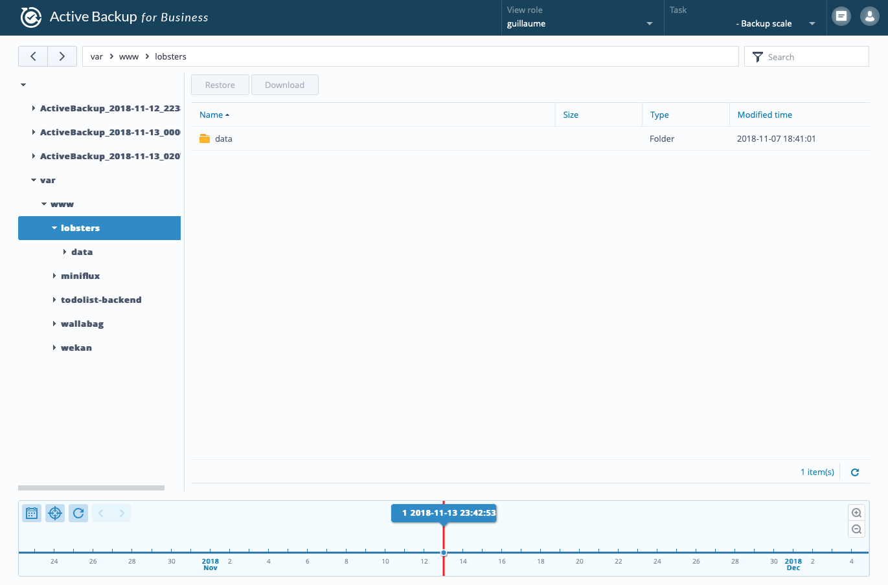

Synology a récemment mis à jour sa solution de sauvegarde pour l'entreprise, à savoir [Active Backup Suite](https://www.synology.com/en-global/dsm/feature/active_backup_suite).

On peut se servir de ce paquet pour sauvegarder plusieurs services comme des machines virtuelles, des ordinateurs sous Windows et surtout des serveurs de fichiers. Dans notre cas c'est le dernier service qui va nous concerner.

En effet, on veut sauvegarder un serveur sous Linux sur notre NAS.

## Créer une tâche de sauvegarde

Une fois le [paquet installé](https://www.synology.com/en-global/dsm/packages/ActiveBackup) sur votre NAS, il faut se rendre dans l'onglet `File server` puis cliquer sur `Add server`.

Vous avez le choix entre une connexion `SMB` ou `rsync`. Il faut choisir `rsync`. En effet, il est installé par défaut sur la plupart des distributions Linux et il gère les sauvegardes incrémentielles et différentielles.

Vous êtes alors invité à fournir les informations de connexion pour votre serveur. Je vous conseille fortement de vous connecter en SSH avec un compte et une clé qui ne servira qu'à la sauvegarde.

Pour générer une clé SSH et l'ajouter sur votre serveur, j'ai déjà fait un article à ce sujet : [Se connecter via SSH à un serveur distant](/se-connecter-via-ssh-a-un-serveur-distant).

Il faut uploader sur le NAS sa clé privée uniquement et ajouter la clé publique sur le serveur distant.

On peut alors choisir le type de backup que l'on veut, parmi le `multi-versioned`, le `mirroring` et enfin l'`incremental`. Il n'y a pas de bons ou de mauvais choix, à vous de faire le vôtre selon vos besoins.

Pour ma part, je vais partir sur l'`incremental`, c'est très bien pour utiliser le moins de place possible et c'est pratique en cas de restauration.

L'arborescence de votre serveur devrait apparaitre, vous pouvez choisir les dossiers que vous voulez ajouter dans votre backup.

Pour terminer, choisissez la fréquence à laquelle la tâche va s'exécuter. Le choix va dépendre de votre trafic, de votre place disponible et de vos besoins encore une fois.

Vous pouvez lancer le premier backup directement et en profiter pour vérifier que tout fonctionne.

On peut ajouter autant de tâches et de serveurs que nécessaire pour chaque type de service.

Pour centraliser toutes ces informations, Synology a mis a disposition quelques outils.

## Dashboard et Restore Portal

Le dashboard va permettre d'avoir une vue d'ensemble sur l'activité de vos sauvegardes. Par exemple, sur le calendrier des tâches passées et celles à venir, sur les logs ou encore le poids des fichiers par type de service.

Il est très pratique pour faire du monitoring en plus des emails envoyés pour vous tenir informez plus simplement.

D'un autre côté, le restore portal va être utilisé pour gérer la restauration des vos données sur les serveurs ou PC distants.

On va pouvoir naviguer dans les dossiers et fichiers pour restaurer uniquement les informations qui nous intéressent, comme sur Time Machine ou Hyper Backup, c'est très pratique.

## Conclusion

C'est désormais beaucoup plus simple pour moi de sauvegarder des serveurs Web. Active Backup Suite est un outil vraiment pratique et accessible pour répondre efficacement à une problématique super importante en administration système.

Attention à bien donner les droits nécessaires à l'utilisateur attribué pour la sauvegarde pour qu'il puisse lire et écrire sur le serveur si vous voulez en profiter pleinement.

Merci !
