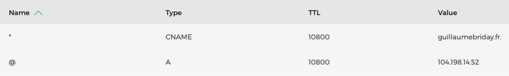

Si vous utilisez plusieurs applications Web sur un ou plusieurs serveurs, vous allez être amené à utiliser un reverse-proxy comme [Nginx](https://www.nginx.com) ou [Traefik](https://traefik.io).

(On aura bientôt l'occasion de largement reparler de Traefik d'ailleurs).

Dans ce cas, on est alors confronté à la problématique de la gestion des noms de domaines et des sous-domaines.

## Avant de commencer

Ce n'est pas un article sur le fonctionnement même des DNS. Je vous invite à regarder l'[article de Grafikart](https://www.grafikart.fr/tutoriels/dns-fonctionnement-1061) à ce sujet si besoin.

Bien sûr, il vous faudra une adresse IP statique accessible sur internet et posséder un nom de domaine si vous voulez reproduire ce que l'on va faire par la suite.

## C'est quoi, un reverse-proxy ?

*Pour simplifier les exemples, on va prendre un cas d'utilisation avec un seul serveur et plusieurs applications lancées dessus.*

Comme le montre bien l'image de présentation de Traefik, un reverse-proxy va être utilisé comme intermédiaire entre les utilisateurs et le serveur. Il va permettre d'associer des URL, avec des domaines et sous-domaines différents, à des applications différentes.


Sans reverse-proxy, on devrait alors utiliser des ports différents pour chaque application, ce qui n'est pas très pratique et assez moche dans l'url.

Par exemple, imaginons que j'ai un back-office sur le port 3000 et une API PHP sur le port 8000, les URL pourraient ressembler à : `guillaumebriday.fr:3000` et `guillaumebriday.fr:8000`.

Nous ce que l'on veut ce serait plutôt `backoffice.guillaumebriday.fr` et `api.guillaumebriday.fr`. C'est beaucoup plus propre et plus simple à maintenir.

On reste toujours sur le même serveur mais c'est le reverse-proxy que devra, en fonction du sous-domaine, rediriger vers soit l'application PHP ou soit celle en Ruby.

Le reverse-proxy permet également de faire du [load balancing](https://en.wikipedia.org/wiki/Load_balancing_(computing)) puisque qu'avec un domaine ou sous-domaine particulier, il pourra rediriger la requête vers autant d'instances de nos applications que nécessaire.

## Configurer ses DNS

Il faut maintenant configurer nos DNS pour obtenir ce comportement. Je vais utiliser l'interface de [Gandi](https://www.gandi.net/en), mais la configuration devrait être très similaire sur un autre service.

Dans un premier temps, nous allons configurer notre domaine principal pour pointer sur notre serveur avec un record de type `A`. Il faut également choisir le TTL de votre enregistrement, en gardant à l'esprit que plus le temps sera court et plus les performances seront affectées, car les clients devront plus régulièrement mettre à jour leur cache.

Et enfin, je vais créer un enregistrement qui s'appliquera à **tous les sous-domaines** avec le caractère spécial `*`. Le type sera cette fois-ci un `CNAME` vers le domaine principal pour n'avoir à changer l'adresse IP du serveur qu'à un seul endroit si besoin.

Ainsi, je peux désormais utiliser des sous-domaines créés dynamiquement, ils pointeront automatiquement sur le bon serveur.



Et dans sa version texte :

```
* 10800 IN CNAME guillaumebriday.fr.
@ 10800 IN A 104.198.14.52
```

Le `@` fait référence au nom de domaine directement, dans mon cas c'est `guillaumebriday.fr.`.

## Attention à la propagation

Les enregistrements DNS sont mis en cache à plusieurs niveaux, que ça soit côté client ou côté serveur.

Il faut donc penser une mise à jour de DNS en amont. Pour éviter les erreurs, vous pouvez progressivement réduire le TTL d'un enregistrement pour limiter les erreurs liées au cache lors d'un changement d'adresse IP.

En effet, par exemple, si je mets un TTL de huit heures et que je change l'adresse IP, l'application sera potentiellement inaccessible pendant ce temps pour certains utilisateurs qui ont toujours l'ancienne adresse IP en cache. Si je réduis fortement ce temps, alors le downtime sera beaucoup plus court voire imperceptible.

Il faudra penser à remettre un TTL raisonnable rapidement, une fois tous les caches invalidés.

## Conclusion

Avec ce fonctionnement, on va pouvoir mettre en place des outils super cool comme les Review Apps ou encore des services auto-hébergés pour ne plus utiliser ceux de Google par exemple. À lire bientôt sur le blog.

Merci !
